class: inverse, center, middle

background-image: url(https://images-na.ssl-images-amazon.com/images/S/sgp-catalog-images/region_US/4mgrh-2BFGWNBQMMT-Full-Image_GalleryBackground-en-US-1556151708125._SX1080_.jpg)
background-size: cover


# Bachelors to PhD: Taking the leap

### Rushani Wijesuriya

.large[ISCB 2020-ECB day| 28 Aug 2020]

---

class: center
# About me

--
.pull-left[I’m from Sri Lanka, a small island nation in the Indian ocean] 

```{r echo=FALSE, out.width="75%"}
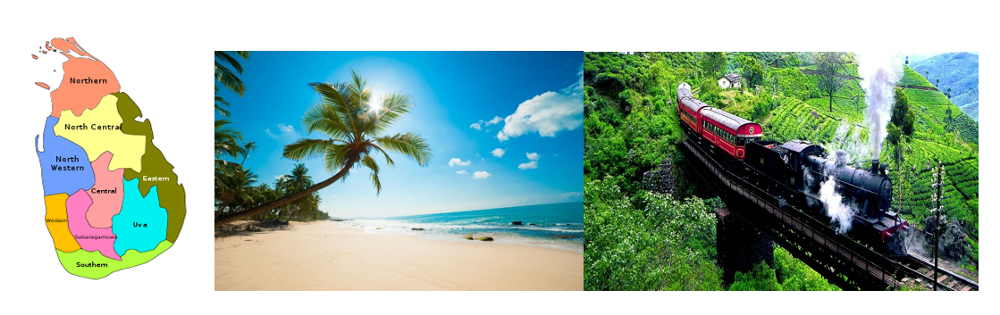
```

--
.left[My journey so far...]

```{r echo=FALSE, out.width="75%"}
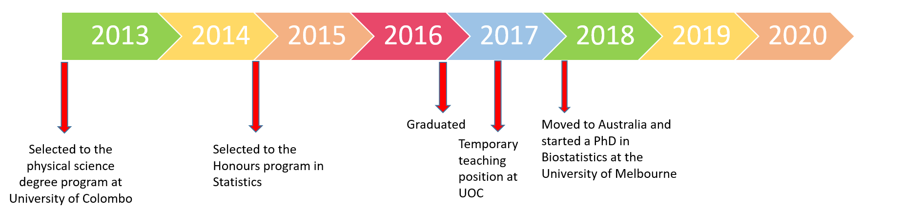
```

---
class: center

#Why did i decide to do a PhD?

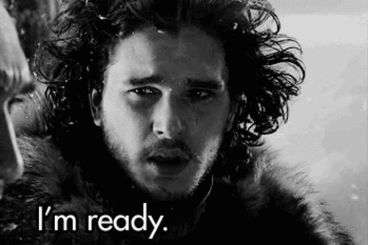

---
class: center

#About me


.pull-left[ ###At the begining of the PhD

```{r echo=FALSE,out.width = "100%"}
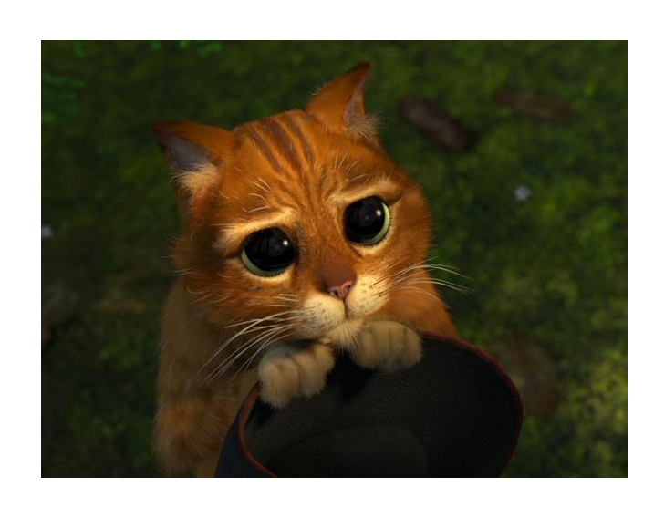
```
] 
--
.pull-right[###Now

```{r echo=FALSE,out.width = "50%"}
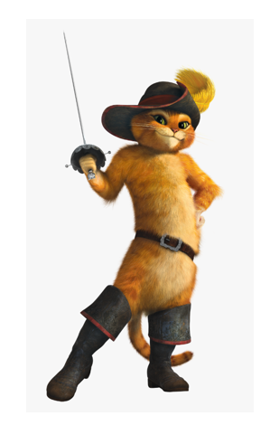
```

]


---
background-image: url(gifs/lightbulb.jpg)

# Realization #1- The knowledge gap

--

Going from an undergraduate to a PhD is a massive adjustment 

--

I had to catch up to a lot of new work and new techniques/skills


```{r echo=FALSE, out.width="50%", fig.pos="bottom"}
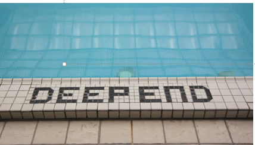
```

---
background-image: url(gifs/lightbulb.jpg)

# Realization #2-People Skills

--
Establishing professional relationships all from day one from scratch 

--

Use all opportunities
- Join a students’ association
- Choose to not work from home
- Conferences

```{r echo=FALSE, out.width="30%"}
knitr::include_graphics("gifs/RSA.PNG")
```
```{r echo=FALSE, out.width="30%"}
knitr::include_graphics("gifs/YSC.PNG")
```

---

background-image: url(gifs/lightbulb.jpg)

# Realization #3- It's a long haul

--

I was anxious because I felt like I had a lot to do to catch-up

--

I couldn’t evaluate whether I was doing well

--

Set smaller milestones to track progress

```{r echo=FALSE, out.width="50%"}
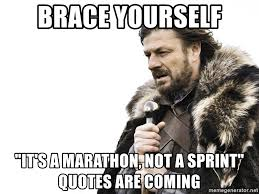
```

---
background-image: url(gifs/lightbulb.jpg)

# Realization #4-Aiming for perfection

--

“Best is the enemy of the good”

--

Get feedback whenever possible from supervisors


```{r echo=FALSE, out.width="60%"}
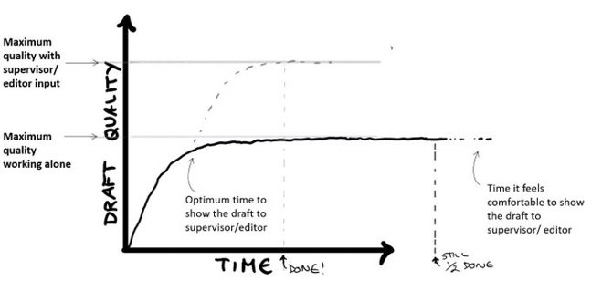
```


---
background-image: url(gifs/lightbulb.jpg)

# Realization #5-Growing thicker skin

--

I had to teach myself to handle constructive criticism 

--

This is a very important skill because your work will continuously get critiqued


```{r echo=FALSE, out.width="50%"}
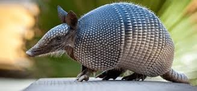
```
---
background-image: url(gifs/lightbulb.jpg)

# Realization#6- There is a steep learning curve

--

First year was slow and challenging

--

Comparatively the second and third years have been easier 


```{r echo=FALSE, out.width="60%"}
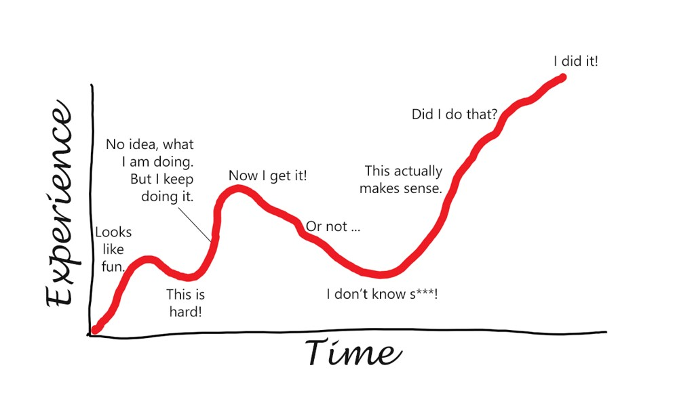
```
---
class: center

# So should you do it?

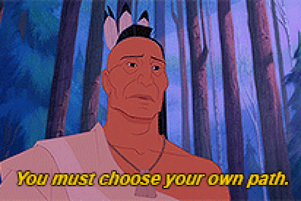

Depens on *YOUR* circumstances and preferences
---
# Using a stepping stone

--
Can be a good way to decide if you want to move on to a PhD

--

Makes you more competitive when applying for a PhD program

--

Discover how best you learn and what kind of supervisor you will work best with 
.pull-right[
```{r echo=FALSE, out.width="100%"}
knitr::include_graphics("gifs/stepping-stone.PNG")
```
]
---
# Taking the leap

--

Timing- If you spot your ideal PhD straight away, it could make sense to apply 

--

Same applies for funding too 

--

Also for international students- Visa issues


```{r echo=FALSE, out.width="30%"}
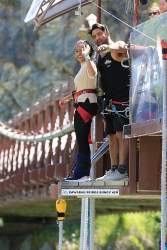
```
```{r echo=FALSE, out.width="30%"}
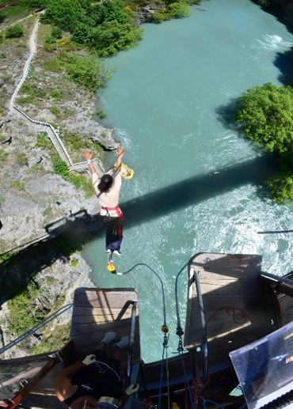
```

---
class:center

# Taking the leap

```{r echo=FALSE, out.width="25%"}
knitr::include_graphics("gifs/get.PNG")

knitr::include_graphics("gifs/paper1.PNG")

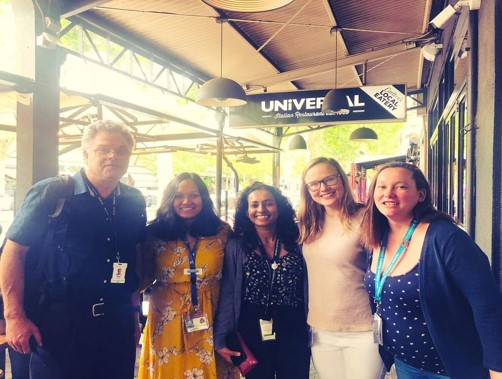

knitr::include_graphics("gifs/anthony.PNG")

```

```{r echo=FALSE, out.width="25%"}
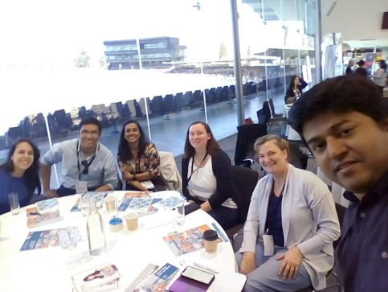


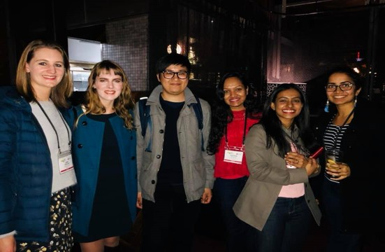

knitr::include_graphics("gifs/YSC2.PNG")

```


---
class:center
# Look before you leap


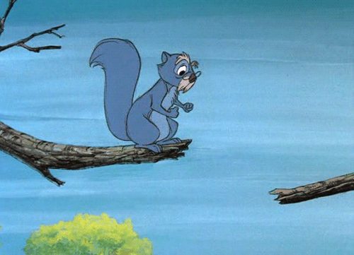

--

.left[There is the risk of putting too much pressure on your shoulders]

--

.left[So if you are considering this path it might be best to find a bit more about the experience]

--

.left[Talk to those who have done the same thing  or better, if possible find a mentor with similar experience who can guide you through]


